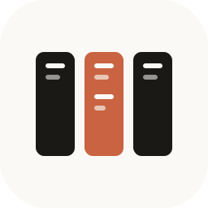
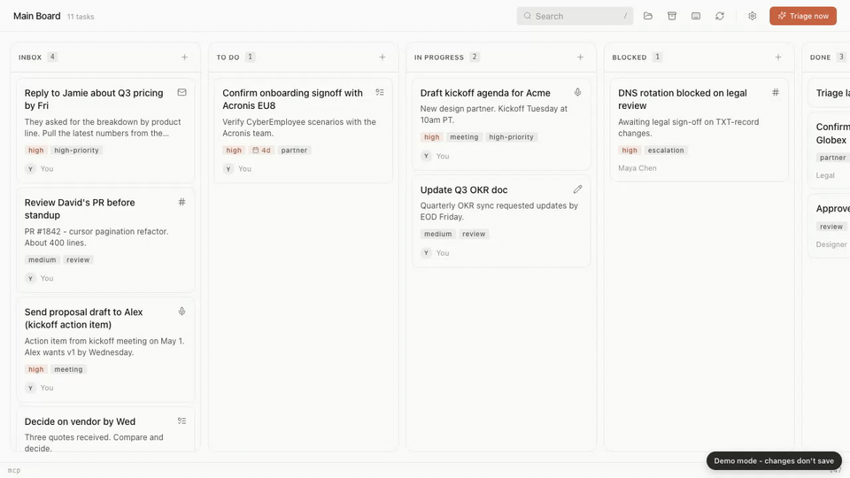
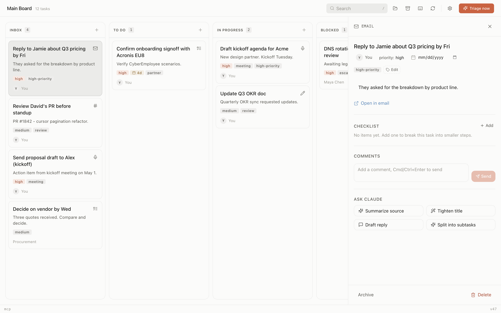
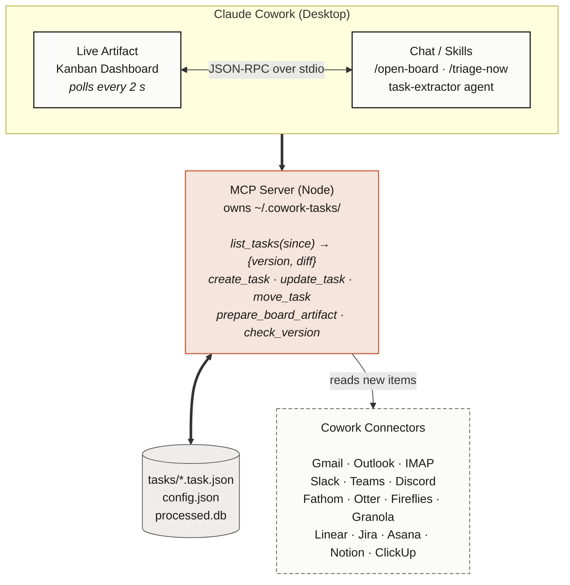

<div align="center">



# Cowork Tasks

### The kanban that fills itself in.<br/><sub>Watches email, Slack, meetings, and issue trackers. Writes the cards. You drag Done.</sub>

[](LICENSE)
[](https://github.com/sabbah13/cowork-tasks/actions)
[](https://www.npmjs.com/package/@cowork-tasks/mcp-server)
[](docs/architecture.md#performance-budget)
[](https://github.com/sabbah13/cowork-tasks/stargazers)

<a href="https://cowork-tasks.vercel.app" target="_blank">

</a>

**[Try the live demo - no signup, no install](https://cowork-tasks.vercel.app)**

<sub>Drag cards, open the side panel, click <em>Ask Claude</em> actions. Seeded with real-looking data.</sub>

</div>

---

**Cowork Tasks** is a kanban board that watches your work happen and updates itself. Cards arrive from your email, Slack, meetings, Linear, and Jira automatically. Replies, status changes, and new deadlines move them around in the background. You drag the ones that matter to Done.

Built for developers, founders, and technical PMs who live in their inbox and hate retyping tasks into a second app.

**No API key needed.** Runs on your existing Cowork plan. **Local-first:** tasks live in `~/.cowork-tasks/` - not someone else's cloud.

Most task tools make you retype work into them. Cowork Tasks reads where the work already lives - your inbox, your Slack, your meeting transcripts.

Built on Anthropic's Live Artifacts (released April 2026). The first kanban board on this substrate.

## What gets captured

| What happens | What lands on your board |
|---|---|
| Email asking "can you review this by Fri?" | Card in **Inbox** with the email linked |
| Slack DM "could you handle X today?" | Card in **Inbox** with the permalink |
| Meeting transcript "Sam will draft the proposal" | Card in **Inbox** with the Fathom timestamp |
| Linear / Jira issue assigned to you | Card in **Inbox** with the issue link |
| A reply on the same email thread | Same card, updated |
| The issue moves to In Review | Same card, status updated |

The assistant keeps watching and updating in the background. Coach mode (`/coach-me`) reads your board and picks two to start with, flags what's stuck, calls out what to drop.

## Install

**Requirements:** Claude Cowork Desktop (any version) or Claude Code CLI. Node 18+ for local development. No other dependencies.

**In Claude Cowork (Desktop):**

1. Customize → Plugins → **Add marketplace**
2. Paste `sabbah13/cowork-tasks`, click **Sync**
3. Install **Cowork Tasks** from the marketplace

**In Claude Code (CLI):**

```bash
claude plugin marketplace add sabbah13/cowork-tasks && claude plugin install cowork-tasks
```

Then run `/open-board` and your kanban opens in the Live Artifacts tab.

## Quickstart

```text
/setup        — connect your sources (Gmail, Slack, Fathom, ...)
/open-board   — open the live kanban
/triage-now   — pull your latest action items from connected sources
/new-task     — capture a thought from chat as an action item
/coach-me     — ask the coach what to start with, what's stuck, what to drop
/health       — connector + board status
```

## Card detail + Ask Claude actions

<a href="https://cowork-tasks.vercel.app" target="_blank">

</a>

Click any card to open the side panel. Source link, priority, due date, checklist, comments, and four AI actions - **Summarize source**, **Tighten title**, **Draft reply**, **Split into subtasks**. Powered by your Cowork plan. No API key needed.

## Features

### Core

| | |
|---|---|
| **Always-on assistant** | Watches your communications and creates cards as work happens. Updates existing cards when replies, status changes, or new deadlines arrive. |
| **Coach mode** | `/coach-me` reads your board, picks 2 to start with, flags what's stuck, calls out what to drop. |
| **AI card actions** | Summarize source, tighten title, draft reply, split into subtasks - powered by your Cowork plan, no extra key. |
| **Local-first** | Tasks are JSON files in `~/.cowork-tasks/`. Yours. Offline-readable. No cloud dependency. |

### Technical

| | |
|---|---|
| **Delta-only polling** | Every connector uses the source's native cursor API (Gmail historyId, Slack cursor, Linear updatedAt). No full re-scans. Zero wasted tokens. |
| **Batched LLM triage** | 1-hour cadence by default. ~30x cheaper than per-message processing. |
| **Live artifact UI** | Native Claude Cowork dashboard. Refreshes every 2 seconds. Unchanged state = empty diff = zero re-renders. |
| **MIT licensed** | Build a connector in 50 lines of TypeScript. Fork, extend, ship. |

## Sources supported

| Family | Connectors |
|---|---|
| Email | Gmail, Outlook / Microsoft 365, IMAP (Fastmail, ProtonMail, iCloud, ...) |
| Meetings / note-takers | Fathom, Otter.ai, Fireflies.ai, Granola, Read.ai, Tactiq, Sembly, Avoma, Zoom AI Companion, Microsoft Teams, Google Meet (Gemini) |
| Chat | Slack, Microsoft Teams, Discord, Telegram |
| Issues / project trackers | Jira, Linear, Asana, ClickUp, Notion, Monday, Trello, GitHub Issues, GitLab Issues, YouTrack |

Don't see yours? **[Add a connector in 50 lines](CONTRIBUTING.md#adding-a-connector).**

## Architecture



See [docs/architecture.md](docs/architecture.md) for the full diagram.

## Comparison

| | Cowork Tasks | Linear | Motion | Notion AI |
|---|---|---|---|---|
| **Tasks update themselves when reality changes** | ✓ | ✗ | ✗ | ✗ |
| Auto-capture from email | ✓ | ✗ | partial | ✗ |
| Auto-capture from meetings | ✓ | ✗ | ✗ | ✗ |
| Auto-capture from Slack | ✓ | partial | ✗ | ✗ |
| Coach mode (picks 2 to start, flags stuck, calls out drops) | ✓ | ✗ | ✗ | ✗ |
| Data on your machine | ✓ | ✗ | ✗ | ✗ |
| Open source | MIT | proprietary | proprietary | proprietary |
| **Cost** | **$0 + $0.30/mo LLM** | $8/user/mo | $34/mo | $10/user/mo |

## Roadmap

**Shipped:** Core MCP server, live artifact UI, Gmail + Slack + Fathom connectors.

**Upcoming:**
- [ ] Outlook, Otter, Granola connectors (v0.2)
- [ ] Linear, Jira, Notion connectors (v0.3)
- [ ] Calendar awareness - auto-task from accepted invites (v0.4)
- [ ] Team mode: shared board across multiple Cowork users (v1.0)
- [ ] Custom views: list, calendar, timeline (v1.1)

PRs welcome - [good-first-issue](https://github.com/sabbah13/cowork-tasks/labels/good%20first%20issue).

## Contributing

We love connectors. See [CONTRIBUTING.md](CONTRIBUTING.md). Quick links:

- [Add a connector in 4 steps](CONTRIBUTING.md#adding-a-connector)
- [Architecture overview](docs/architecture.md)
- [Task schema reference](docs/task-schema.md)
- [Code of Conduct](CODE_OF_CONDUCT.md)
- [Security policy](SECURITY.md)

**Maintainer SLA:** PRs reviewed within 48 hours. Connector PRs are usually merged the same week.

*Used by the maintainer daily. Feedback and battle reports welcome in [Discussions](https://github.com/sabbah13/cowork-tasks/discussions).*

## Community

- [GitHub Discussions](https://github.com/sabbah13/cowork-tasks/discussions) - questions, showcases, connector wishlist
- [Issues](https://github.com/sabbah13/cowork-tasks/issues) - bugs and feature requests
- Discord - in progress, [upvote to prioritize](https://github.com/sabbah13/cowork-tasks/discussions)

[](https://github.com/sabbah13/cowork-tasks/graphs/contributors)

## License

[MIT](LICENSE) - free to use, modify, and ship.
