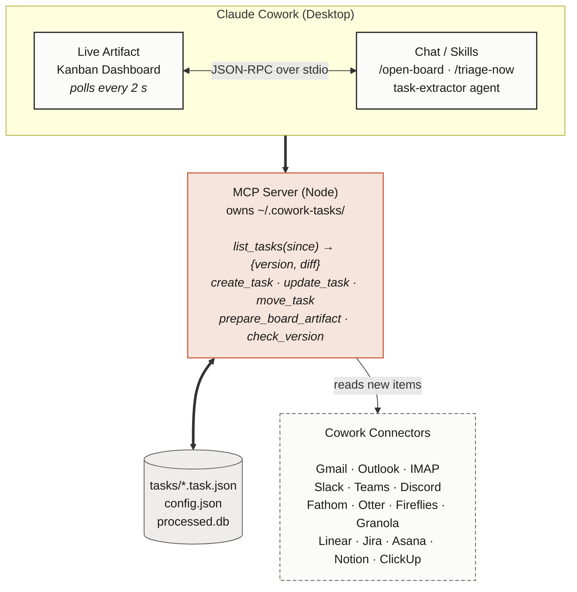

<div align="center">


# Cowork Tasks

### The first kanban task manager for Claude Cowork.<br/>An always-on assistant that watches your communications and turns them into tasks.

[](LICENSE)
[](https://github.com/sabbah13/cowork-tasks)
[](https://support.claude.com/en/articles/14729249-use-live-artifacts-in-claude-cowork)
[](#sources-supported)
[](docs/architecture.md#performance-budget)
[](#)
[](https://github.com/sabbah13/cowork-tasks/discussions)

<a href="https://cowork-tasks.vercel.app" target="_blank">

</a>

### [**Try the live demo →**](https://cowork-tasks.vercel.app)

<sub>The real artifact, running in your browser with seeded data. Drag cards, open the side panel, click <em>Ask Claude</em> actions. No signup. No install.</sub>

</div>

---

**Cowork Tasks** is the first kanban task manager for Claude Cowork. It runs as an always-on assistant: it watches your email, meetings, Slack, and issue trackers, extracts the tasks and updates buried in them, and keeps a live board you can drag from Inbox to Done.

It's local-first, MIT-licensed, and uses Claude Cowork's native Live Artifacts as its UI - so the board feels like part of Claude itself.

> **Why this exists.** Anthropic shipped Live Artifacts on April 20, 2026. As of today, no other kanban / Trello-style live artifact exists in the Claude plugin marketplace. We're the first one - and we'd like to keep it that way by being the most useful, most contributor-friendly choice. Stars, forks, and 50-line connector PRs are how that happens.

## How it watches your work

Cowork Tasks is the assistant that turns your communications into tasks. The work that already lives in your inbox, your Slack, your meeting recordings - it shows up as cards on a kanban automatically. New replies and status changes update the cards as they happen.

| What happens | What lands on your board |
|---|---|
| Email asking "can you review this by Fri?" | Card in **Inbox** with the email linked |
| Slack DM "could you handle X today?" | Card in **Inbox** with the permalink |
| Meeting transcript "Sam will draft the proposal" | Card in **Inbox** with the Fathom timestamp |
| Linear / Jira issue assigned to you | Card in **Inbox** with the issue link |
| A reply on the same email thread | Same card, updated |
| The issue moves to In Review | Same card, status updated |

The assistant keeps watching and updating in the background. Coach mode (`/coach-me`) reads your board and picks two to start with, flags what's stuck, calls out what to drop.

## Install

**In Claude Cowork (Desktop):**

1. Customize → Plugins → **Add marketplace**
2. Paste `sabbah13/cowork-tasks`, click **Sync**
3. Install **Cowork Tasks** from the marketplace

**In Claude Code (CLI):**

```bash
claude plugin marketplace add sabbah13/cowork-tasks
claude plugin install cowork-tasks
```

Then run `/open-board` and your kanban opens in the Live Artifacts tab.

## Quickstart

```text
/setup        — connect your sources (Gmail, Slack, Fathom, ...)
/open-board   — open the live kanban
/triage-now   — pull your latest action items from connected sources
/new-task     — capture a thought from chat as an action item
/coach-me     — ask the coach what to start with, what's stuck, what to drop
/health       — connector + board status
```

## Card detail + Ask Claude actions

<a href="https://cowork-tasks.vercel.app" target="_blank">

</a>

Click any card to open the side panel. Source link, priority, due date, checklist, comments, and four AI actions powered by `window.claude.complete()` - **Summarize source**, **Tighten title**, **Draft reply**, **Split into subtasks**. Calls hit your Cowork plan, no API key needed.

## Features

| | |
|---|---|
| **Always-on assistant** | Watches your communications and creates cards as work happens. Updates existing cards when replies, status changes, or new deadlines arrive |
| **Coach mode** | `/coach-me` reads your board, picks 2 to start with, flags what's stuck, calls out what to drop |
| **Live artifact UI** | Native Claude Cowork dashboard, refreshes in 2 s |
| **Auto-ingest** | Email, meetings, chat, issue trackers - 20+ sources |
| **Local-first** | Tasks live as JSON files in `~/.cowork-tasks/`, not someone else's cloud |
| **Cursor-driven** | Every connector uses native delta APIs (Gmail historyId, Graph deltaLink, Linear updatedAt). No full re-scans, ever. |
| **Batched LLM triage** | Default cadence: 1 hour. Cuts token spend ~30x vs per-arrival. |
| **Source links** | Every card links back to the email / Slack permalink / Fathom timestamp |
| **MIT, open-source** | Build connectors in 50 lines of TypeScript |

## Sources supported

| Family | Connectors |
|---|---|
| Email | Gmail, Outlook / Microsoft 365, IMAP (Fastmail, ProtonMail, iCloud, ...) |
| Meetings / note-takers | Fathom, Otter.ai, Fireflies.ai, Granola, Read.ai, Tactiq, Sembly, Avoma, Zoom AI Companion, Microsoft Teams, Google Meet (Gemini) |
| Chat | Slack, Microsoft Teams, Discord, Telegram |
| Issues / project trackers | Jira, Linear, Asana, ClickUp, Notion, Monday, Trello, GitHub Issues, GitLab Issues, YouTrack |

Don't see yours? **[Add a connector in 50 lines](CONTRIBUTING.md#adding-a-connector).**

## How it works



See [docs/architecture.md](docs/architecture.md) for the full diagram.

## Comparison

| | Cowork Tasks | Linear / Asana | ClickUp + Zapier | Trello |
|---|---|---|---|---|
| Auto-capture from email | yes | no | partial | no |
| Auto-capture from meetings | yes | no | no | no |
| Auto-capture from Slack | yes | partial | partial | no |
| Updates tasks as work evolves (replies, status changes) | yes | no | no | no |
| Coach mode (what to start, what to drop) | yes | no | no | no |
| Local-first (your files) | yes | no | no | no |
| Open-source | MIT | no | no | no |
| Native to Claude / AI | yes | no | no | no |
| Cost (typical) | $0 + ~$0.30/mo LLM | $$ | $$$ | $ |

## Roadmap

- [x] Core MCP server + live artifact
- [x] Gmail, Slack, Fathom connectors
- [ ] Outlook, Otter, Granola connectors (v0.2)
- [ ] Linear, Jira, Notion connectors (v0.3)
- [ ] Calendar awareness (auto-task from accepted invites) (v0.4)
- [ ] Team mode: shared board across multiple Cowork users (v1.0)
- [ ] Custom views: list, calendar, timeline (v1.1)

PRs welcome - [good-first-issue](https://github.com/sabbah13/cowork-tasks/labels/good%20first%20issue).

## Contributing

We love connectors. See [CONTRIBUTING.md](CONTRIBUTING.md). Quick links:

- [Add a connector in 4 steps](CONTRIBUTING.md#adding-a-connector)
- [Architecture overview](docs/architecture.md)
- [Task schema reference](docs/task-schema.md)
- [Code of Conduct](CODE_OF_CONDUCT.md)
- [Security policy](SECURITY.md)

**Maintainer SLA:** PRs reviewed within 48 hours. Connector PRs are usually merged the same week.

## Community

- [GitHub Discussions](https://github.com/sabbah13/cowork-tasks/discussions) - questions, showcases, connector wishlist
- [Issues](https://github.com/sabbah13/cowork-tasks/issues) - bugs and feature requests
- Discord - coming once we hit 500 stars
- Newsletter - coming once we hit 1k stars

[](https://github.com/sabbah13/cowork-tasks/graphs/contributors)

## Star history

[](https://star-history.com/#sabbah13/cowork-tasks&Date)

## License

[MIT](LICENSE) - free to use, modify, and ship.
