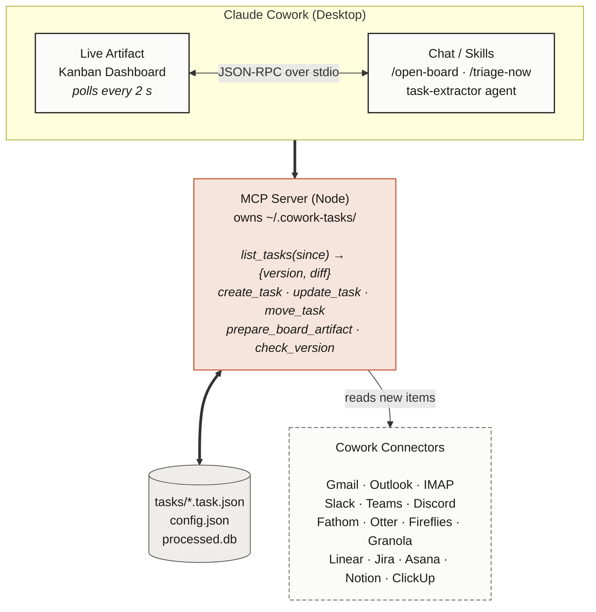

<div align="center">


# Cowork Tasks

### A live kanban board for Claude Cowork.<br/>Your email, meetings, and Slack become tasks - automatically.

[](LICENSE)
[](https://github.com/sabbah13/cowork-tasks)
[](#)

</div>

---

**Cowork Tasks** is a Claude Cowork plugin that gives you a real-time kanban board, fed automatically by everything happening around you - email, meetings, Slack, Jira. New work shows up as a card. You drag it to Done.

It's local-first, MIT-licensed, and uses Claude Cowork's native live artifacts as its UI - so the board feels like part of Claude itself.

## Why

- **Tasks slip through cracks.** A Slack message from your boss, a "let's do X" in a meeting, an email asking for a doc review - half of them never make it into your task list.
- **Manual capture is a tax.** You shouldn't have to retype what's already in your inbox.
- **You stay in control.** Auto-captured tasks land in **Inbox** for you to triage, never auto-promoted.

## Install

**In Claude Cowork (Desktop):**

1. Customize → Plugins → **Add marketplace**
2. Paste `sabbah13/cowork-tasks`, click **Sync**
3. Install **Cowork Tasks** from the marketplace

**In Claude Code (CLI):**

```bash
claude plugin marketplace add sabbah13/cowork-tasks
claude plugin install cowork-tasks
```

Then run `/open-board` and your kanban opens in the Live Artifacts tab.

## Quickstart

```text
/setup        — connect your sources (Gmail, Slack, Fathom, ...)
/open-board   — open the live kanban
/triage-now   — run triage on demand (otherwise hourly)
/new-task     — capture a thought from chat
/health       — connector + board status
```

## Features

| | |
|---|---|
| **Live artifact UI** | Native Claude Cowork dashboard, refreshes in 2 s |
| **Auto-ingest** | Email, meetings, chat, issue trackers - 20+ sources |
| **Local-first** | Tasks live as JSON files in `~/.cowork-tasks/`, not someone else's cloud |
| **Cursor-driven** | Every connector uses native delta APIs (Gmail historyId, Graph deltaLink, Linear updatedAt). No full re-scans, ever. |
| **Batched LLM triage** | Default cadence: 1 hour. Cuts token spend ~30x vs per-arrival. |
| **Source links** | Every card links back to the email / Slack permalink / Fathom timestamp |
| **VSCode bonus** | Same board inside VSCode (`Cmd+Shift+K`) via the bundled extension |
| **MIT, open-source** | Build connectors in 50 lines of TypeScript |

## Sources supported

| Family | Connectors |
|---|---|
| Email | Gmail, Outlook / Microsoft 365, IMAP (Fastmail, ProtonMail, iCloud, ...) |
| Meetings / note-takers | Fathom, Otter.ai, Fireflies.ai, Granola, Read.ai, Tactiq, Sembly, Avoma, Zoom AI Companion, Microsoft Teams, Google Meet (Gemini) |
| Chat | Slack, Microsoft Teams, Discord, Telegram |
| Issues / project trackers | Jira, Linear, Asana, ClickUp, Notion, Monday, Trello, GitHub Issues, GitLab Issues, YouTrack |

Don't see yours? **[Add a connector in 50 lines](CONTRIBUTING.md#adding-a-connector).**

## How it works



See [docs/architecture.md](docs/architecture.md) for the full diagram.

## Comparison

| | Cowork Tasks | Linear / Asana | Todoist |
|---|---|---|---|
| Auto-capture from email | yes | no | no |
| Auto-capture from meetings | yes | no | no |
| Auto-capture from Slack | yes | partial | no |
| Local-first (your files) | yes | no | no |
| Open-source | MIT | no | no |
| Native to Claude / AI | yes | no | no |

## Roadmap

- [x] Core MCP server + live artifact
- [x] Gmail, Slack, Fathom connectors
- [ ] Outlook, Otter, Granola connectors (v0.2)
- [ ] Linear, Jira, Notion connectors (v0.3)
- [ ] Calendar awareness (auto-task from accepted invites) (v0.4)
- [ ] Team mode: shared board across multiple Cowork users (v1.0)
- [ ] Custom views: list, calendar, timeline (v1.1)

PRs welcome - [good-first-issue](https://github.com/sabbah13/cowork-tasks/labels/good%20first%20issue).

## Contributing

We love connectors. See [CONTRIBUTING.md](CONTRIBUTING.md). Quick links:

- [Add a connector in 4 steps](CONTRIBUTING.md#adding-a-connector)
- [Architecture overview](docs/architecture.md)
- [Task schema reference](docs/task-schema.md)

## Star history

[](https://star-history.com/#sabbah13/cowork-tasks&Date)

## License

[MIT](LICENSE) - free to use, modify, and ship.
