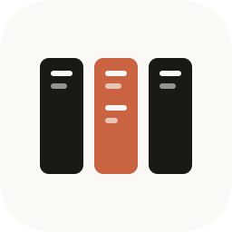
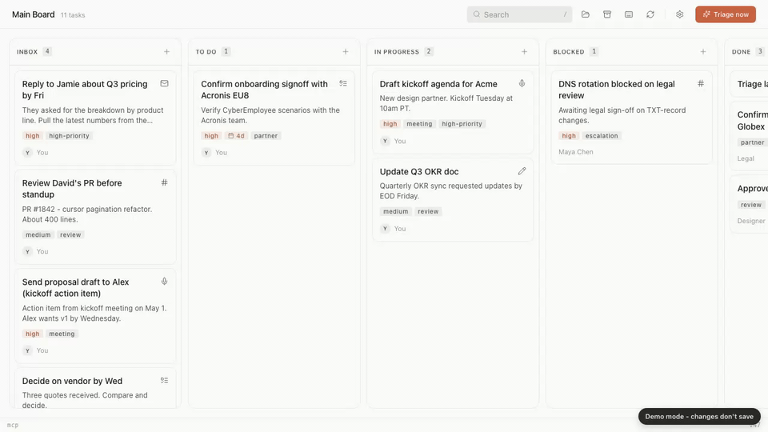
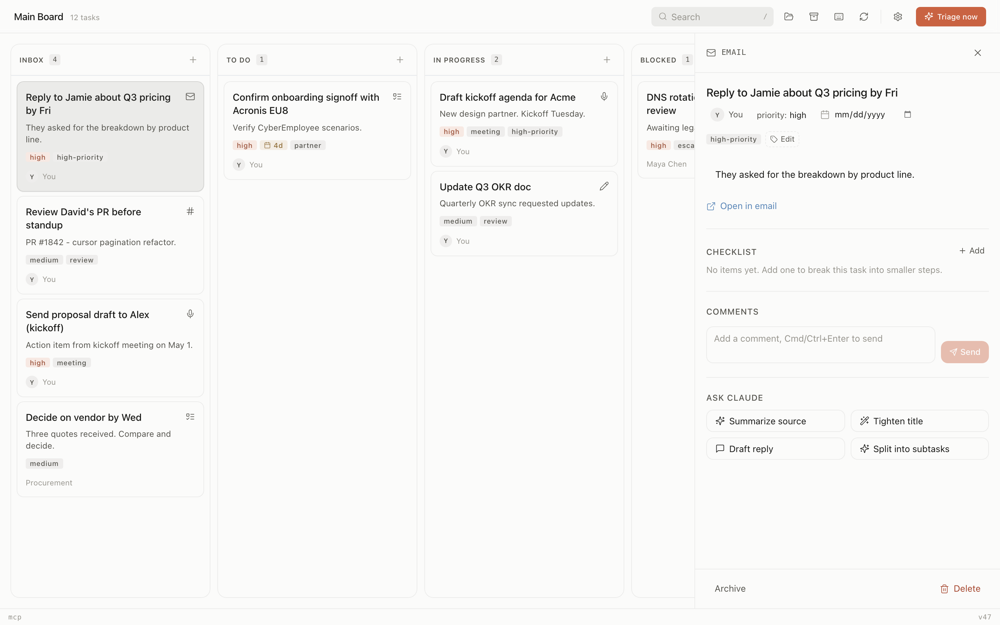
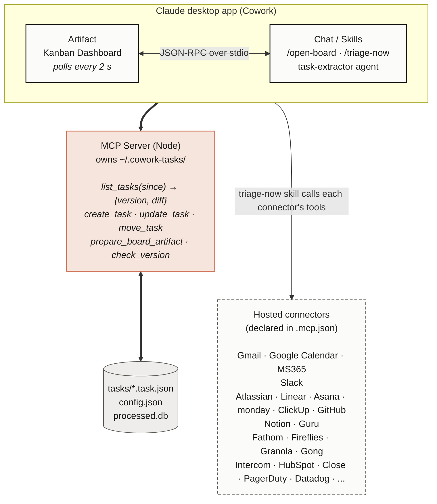

<div align="center">



# Cowork Tasks

### The kanban that fills itself in.<br/><sub>Watches email, Slack, meetings, and issue trackers. Writes the cards. You drag Done.</sub>

[](LICENSE)
[](https://github.com/sabbah13/cowork-tasks/actions)
[](https://www.npmjs.com/package/@cowork-tasks/mcp-server)
[](docs/architecture.md#performance-budget)
[](https://github.com/sabbah13/cowork-tasks/stargazers)

<a href="https://cowork-tasks.vercel.app" target="_blank">

</a>

**[Try the live demo - no signup, no install](https://cowork-tasks.vercel.app)**

<sub>Drag cards, open the side panel, click <em>Ask Claude</em> actions. Seeded with real-looking data.</sub>

</div>

---

**Cowork Tasks** is a kanban board that watches your work happen and updates itself. Cards arrive from your email, Slack, meetings, Linear, and Jira automatically. Replies, status changes, and new deadlines move them around in the background. You drag the ones that matter to Done.

Built for developers, founders, and technical PMs who live in their inbox and hate retyping tasks into a second app.

**No API key needed. No tokens to paste.** Cowork Tasks reads from the connectors you've connected in Claude (**Customize > Connectors**). The plugin lists 26 supported connectors (Gmail, Slack, Atlassian, Linear, Notion, Fathom, ...) on its own **Connectors** tab, where you add and connect the ones you want. **Local-first:** tasks live in `~/.cowork-tasks/` - not someone else's cloud.

Most task tools make you retype work into them. Cowork Tasks reads where the work already lives - your inbox, your Slack, your meeting transcripts.

The board is a Claude artifact. Since 0.4.16 it is published as a regular artifact and reads and writes your tasks through the artifact runtime's `mcp` capability (`claude.use("mcp")`), which Anthropic introduced in August 2026 in place of live artifacts. Outside the Claude app it degrades to a clearly labelled read-only snapshot. See the [audit and refactor plan](docs/audit-2026-10.md).

## What gets captured

| What happens | What lands on your board |
|---|---|
| Email asking "can you review this by Fri?" | Card in **Inbox** with the email linked |
| Slack DM "could you handle X today?" | Card in **Inbox** with the permalink |
| Meeting transcript "Sam will draft the proposal" | Card in **Inbox** with the Fathom timestamp |
| Linear / Jira issue assigned to you | Card in **Inbox** with the issue link |
| A reply on the same email thread | Same card, updated |
| The issue moves to In Review | Same card, status updated |

The assistant keeps watching and updating in the background. Coach mode (`/coach`) reads your board and picks two to start with, flags what's stuck, calls out what to drop.

## Install

**Requirements:** the Claude desktop app (Cowork sessions run on your computer, which the bundled local MCP server needs) or Claude Code CLI. Chat on the web or mobile ignores local MCP servers. Node 20+ for local development. No other dependencies.

**In the Claude desktop app:**

1. **Customize > Plugins > Add > Add marketplace**
2. Enter `sabbah13/cowork-tasks` (turn on **Sync automatically** to receive updates)
3. Install **Cowork Tasks** from the marketplace
4. Open the plugin's **Connectors** tab and add and connect the sources you want

**In Claude Code (CLI):**

```bash
claude plugin marketplace add sabbah13/cowork-tasks && claude plugin install cowork-tasks@cowork-tasks
```

Then run `/cowork-tasks:setup`: it shows Connect buttons for your email, calendar, chat, meetings and issue trackers, pulls your first batch of action items from whatever is already connected, and opens your kanban as an artifact in the **Artifacts** view.

## Quickstart

```text
/setup        - start here: shows Connect buttons for your sources, pulls your
                first batch of action items (last 14 days) and opens the board
/open-board   - open the kanban
/triage-now   - pull what's new since the last triage (first run: 14 days back)
/new-task     - capture a thought from chat as an action item
/coach        - ask the coach what to start with, what's stuck, what to drop
/health       - connector + board status
```

## Card detail + Ask Claude actions

<a href="https://cowork-tasks.vercel.app" target="_blank">

</a>

Click any card to open the side panel. Source link, priority, due date, checklist, comments, and four AI actions - **Summarize source**, **Tighten title**, **Draft reply**, **Split into subtasks**. Each one builds a ready-to-run prompt and copies it to your clipboard; paste it into the conversation and Claude runs it on your plan. No API key needed. (Running them inside the board returns with the new artifact runtime.)

## Features

### Core

| | |
|---|---|
| **Always-on assistant** | Watches your communications and creates cards as work happens. Updates existing cards when replies, status changes, or new deadlines arrive. |
| **Coach mode** | `/coach` reads your board, picks 2 to start with, flags what's stuck, calls out what to drop. |
| **AI card actions** | Summarize source, tighten title, draft reply, split into subtasks - prepared as a prompt you paste into Claude, so they run on your plan with no extra key. |
| **Local-first** | Tasks are JSON files in `~/.cowork-tasks/`. Yours. Offline-readable. No cloud dependency. |

### Technical

| | |
|---|---|
| **Connector-based composition** | The plugin doesn't ship its own OAuth, polling daemons, or per-source binaries. It composes the hosted connectors you've connected in **Customize > Connectors**. One auth surface, shared with every other plugin. |
| **Batched LLM triage** | One LLM call per triage run, not per message. The `triage-now` skill pulls deltas from each enabled connector, hands them to the `task-extractor` agent in a single batch, then writes only the owner's own action items to the board. |
| **Artifact UI** | Kanban dashboard inside Claude. Refreshes every 2 seconds. Unchanged state = empty diff = zero re-renders. |
| **MIT licensed** | Fork the artifact UI, extend the triage rules, contribute new skills. The plugin is a kanban + skills + agents layer over Claude's connector graph - all of it is yours to remix. |

## Sources supported

Cowork Tasks reads from whatever connectors you've connected. The plugin declares all of these in `.mcp.json`, so they are listed on its **Connectors** tab where you add and connect them. Installing the plugin does not connect anything by itself.

| Family | Connectors used |
|---|---|
| Email | Gmail, Microsoft 365 (Outlook) |
| Calendar | Google Calendar, Microsoft 365 |
| Chat | Slack, Microsoft Teams (via MS365) |
| Issues / project trackers | Atlassian (Jira), Linear, Asana, monday.com, ClickUp, GitHub |
| Knowledge bases | Notion, Guru |
| Meeting recorders | Fathom, Fireflies, Granola, Gong |
| Customer support | Intercom |
| CRM | HubSpot, Close |
| Incidents / on-call | PagerDuty, Datadog |
| Files | Box, Egnyte |
| Signatures | DocuSign |
| Design | Figma, Canva |

The full list lives in [`packages/plugin/.mcp.json`](packages/plugin/.mcp.json). If Anthropic ships a connector for a source we haven't declared yet, open an issue - it's a one-line addition. We do **not** maintain custom connectors in this repo.

## Architecture


```mermaid
flowchart TB
    subgraph Cowork["Claude desktop app (Cowork)"]
        Artifact["Artifact<br/>Kanban Dashboard<br/><i>polls every 2 s</i>"]
        Skills["Chat / Skills<br/>/open-board · /triage-now<br/>task-extractor agent"]
        Artifact <-->|JSON-RPC over stdio| Skills
    end

    MCP["MCP Server (Node)<br/>owns ~/.cowork-tasks/<br/><br/><i>list_tasks(since) → {version, diff}</i><br/><i>create_task · update_task · move_task</i><br/><i>prepare_board_artifact · check_version</i>"]

    Disk[("tasks/*.task.json<br/>config.json<br/>processed.db")]

    Connectors["Hosted connectors<br/>(declared in .mcp.json)<br/><br/>Gmail · Google Calendar · MS365<br/>Slack<br/>Atlassian · Linear · Asana · monday · ClickUp · GitHub<br/>Notion · Guru<br/>Fathom · Fireflies · Granola · Gong<br/>Intercom · HubSpot · Close · PagerDuty · Datadog · ..."]

    Cowork ==> MCP
    MCP <==> Disk
    Cowork <-.triage-now skill calls each connector's tools.- Connectors

    classDef cowork fill:#fbfbfa,stroke:#1a1a18,stroke-width:1.5px,color:#1a1a18;
    classDef accent fill:#f6e5dd,stroke:#c96342,stroke-width:1.5px,color:#1a1a18;
    classDef disk fill:#eeedec,stroke:#56554f,stroke-width:1px,color:#1a1a18;
    classDef ext fill:#fbfbfa,stroke:#56554f,stroke-width:1px,stroke-dasharray:5 3,color:#1a1a18;

    class Artifact,Skills cowork;
    class MCP accent;
    class Disk disk;
    class Connectors ext;
```

See [docs/architecture.md](docs/architecture.md) for the full diagram.

## Comparison

| | Cowork Tasks | Linear | Motion | Notion AI |
|---|---|---|---|---|
| **Tasks update themselves when reality changes** | ✓ | ✗ | ✗ | ✗ |
| Auto-capture from email | ✓ | ✗ | partial | ✗ |
| Auto-capture from meetings | ✓ | ✗ | ✗ | ✗ |
| Auto-capture from Slack | ✓ | partial | ✗ | ✗ |
| Coach mode (picks 2 to start, flags stuck, calls out drops) | ✓ | ✗ | ✗ | ✗ |
| Data on your machine | ✓ | ✗ | ✗ | ✗ |
| Open source | MIT | proprietary | proprietary | proprietary |
| **Cost** | **$0 + $0.30/mo LLM** | $8/user/mo | $34/mo | $10/user/mo |

## Roadmap

**Shipped:** Core MCP server, artifact UI, `triage-now` / `coach` / `setup` / `health` skills, `task-extractor` owner-first agent, 26 connectors declared.

**Upcoming:**
- [ ] Bring in-board AI actions back through the artifact runtime's `sample` capability (see [docs/audit-2026-10.md](docs/audit-2026-10.md))
- [ ] Calendar awareness - auto-task from accepted invites (v0.5)
- [ ] Snooze-until-tomorrow card action (v0.5)
- [ ] Keyboard navigation polish (v0.5)
- [ ] Team mode: shared board across multiple Cowork users (v1.0)
- [ ] Custom views: list, calendar, timeline (v1.1)

PRs welcome - [good-first-issue](https://github.com/sabbah13/cowork-tasks/labels/good%20first%20issue).

## Contributing

UI polish, triage rule improvements, MCP server features, and skill prompts are all welcome. See [CONTRIBUTING.md](CONTRIBUTING.md). Quick links:

- [High-impact areas to work on](CONTRIBUTING.md#high-impact-areas)
- [Local dev setup](docs/local-install.md)
- [Architecture overview](docs/architecture.md)
- [Task schema reference](docs/task-schema.md)
- [Code of Conduct](CODE_OF_CONDUCT.md)
- [Security policy](SECURITY.md)

> **Note on connectors:** Cowork Tasks does **not** ship its own connectors. It composes the hosted connectors declared in [`packages/plugin/.mcp.json`](packages/plugin/.mcp.json). If you want a new source, the right path is for Anthropic to ship the connector - then it's a one-line addition here. We do not accept custom connector packages.

**Maintainer SLA:** PRs reviewed within 48 hours. Good-first-issue PRs are usually merged the same week.

*Used by the maintainer daily. Feedback and battle reports welcome in [Discussions](https://github.com/sabbah13/cowork-tasks/discussions).*

## Community

- [GitHub Discussions](https://github.com/sabbah13/cowork-tasks/discussions) - questions, showcases, source-coverage wishlist (request a connector)
- [Issues](https://github.com/sabbah13/cowork-tasks/issues) - bugs and feature requests
- Discord - in progress, [upvote to prioritize](https://github.com/sabbah13/cowork-tasks/discussions)

[](https://github.com/sabbah13/cowork-tasks/graphs/contributors)

## License

[MIT](LICENSE) - free to use, modify, and ship.
