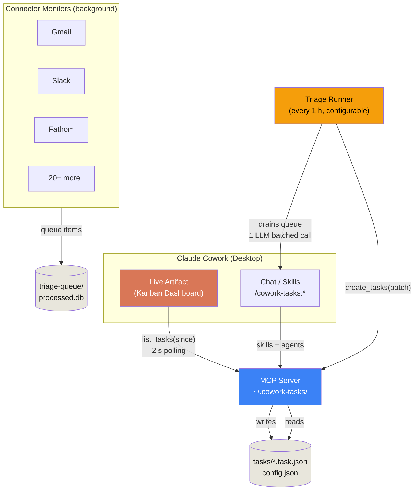

# Architecture

Cowork Tasks has four cooperating layers. Each is replaceable, and each communicates through narrow contracts.



## Layers

### 1. Live artifact

A persistent React HTML page in Cowork's "Live artifacts" tab. Polls the MCP server every 2 s with a version cursor so unchanged steady state costs nothing. All AI actions ("Summarize this email", "Draft a reply") go through `window.claude.complete()` so they feel native to Cowork.

### 2. MCP server

Owns `~/.cowork-tasks/` (the storage root). Exposes CRUD over tasks via JSON-RPC, plus a versioned change feed. Tasks live as one JSON file per task (grep-friendly, git-friendly), with an in-memory index and a coalesced `index.json` snapshot for fast cold-start.

### 3. Connector monitors

Long-running shell processes spawned by Cowork's `monitors/` mechanism. Each one polls a single source (Gmail, Slack, Linear, ...) using the source's native delta primitive (`historyId`, `@odata.deltaLink`, `updatedAt`, ...). When new items arrive, they're written to `~/.cowork-tasks/triage-queue/<connector>/<hash>.json`. **No LLM call here** - this is the cheap, deterministic layer.

### 4. Triage runner

Fires on a schedule (default every 60 minutes, configurable down to 5 or up to 1440). Drains the queue and asks Claude (via the `task-extractor` subagent) to convert raw items into well-formed tasks - in **one** batched call. Cuts token cost ~30x vs per-arrival triage.

## Why these boundaries

- **Artifact <-> MCP** is the only synchronous chatter. Everything else is asynchronous.
- **Connectors don't know about tasks.** They just queue raw items. This means a new connector is small.
- **Triage doesn't know about sources.** It receives a normalized `SourceItem` and emits `Task` drafts.
- **MCP doesn't know about connectors or LLMs.** It's a typed, versioned task store.

Each boundary is a place we can swap an implementation without touching the others.

## Storage

```
~/.cowork-tasks/
+-- tasks/                 # one JSON per task
|   +-- email_review_q3_20260501.task.json
|   +-- meeting_action_kickoff_20260501.task.json
+-- config.json            # columns, labels, owners
+-- credentials/           # encrypted per-connector tokens
+-- cursors/               # per-connector delta cursors
+-- triage-queue/          # raw source items waiting for triage
|   +-- email-gmail/<sha>.json
|   +-- meet-fathom/<sha>.json
+-- cache/                 # content cache (LRU, 500 MB cap)
+-- processed.db           # SQLite: (connector, sourceHash) -> taskId
+-- feedback.db            # SQLite: dismissed-task examples for extractor learning
+-- wal.log                # write-ahead log for MCP version recovery
+-- index.json             # coalesced snapshot for fast cold-start
+-- logs/cowork-tasks.log
```

## Performance budget

| Layer | Idle bytes/min | Active path |
|---|---|---|
| Connector poll (cursor at head, API returns 304) | <2 KB | n/a |
| MCP `list_tasks({since: version})` | <100 B | <1 ms |
| Artifact poll cycle | 1 fetch, 0 React renders | <1 ms |
| Triage runner | 0 (asleep) | 1 LLM call/hour, ~5 K input tokens |

Net: a quiet desktop costs near-zero CPU and zero LLM tokens. New work surfaces in ~2 s after the connector's next poll.
