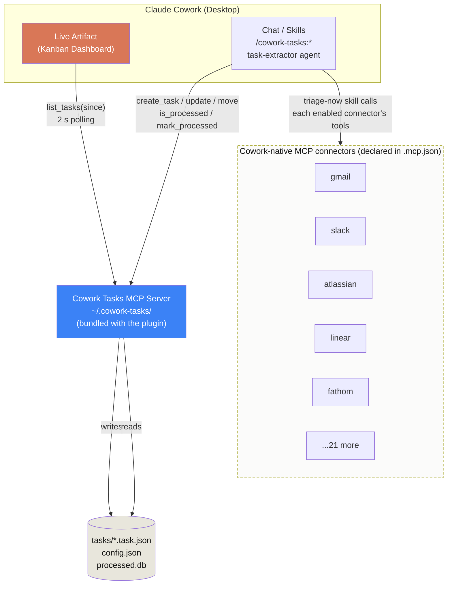

# Architecture

Cowork Tasks is a **composer**, not a connector. It reads from the Cowork-hosted MCP servers you've authorized in **Customize → Connectors**, runs owner-first triage in batches, and writes a local kanban. Three cooperating layers, narrow contracts between them.



## Layers

### 1. Live artifact

A persistent React HTML page in Cowork's "Live artifacts" tab. Polls the MCP server every 2 s with a version cursor so unchanged steady state costs nothing. AI actions ("Summarize this email", "Draft a reply") go through the host AI bridge so they feel native to Cowork.

### 2. Cowork Tasks MCP server (bundled)

Owns `~/.cowork-tasks/` (the storage root). Exposes CRUD over tasks via JSON-RPC, plus a versioned change feed. Tasks live as one JSON file per task (grep-friendly, git-friendly), with an in-memory index and a coalesced `index.json` snapshot for fast cold-start. This is the **only** MCP server the plugin ships - bundled in `packages/plugin/bundle/mcp-server.js`.

### 3. Cowork-native MCP connectors (upstream)

The plugin's `packages/plugin/.mcp.json` declares 26 Cowork-hosted MCP servers (`gmail`, `slack`, `atlassian`, `linear`, `notion`, `fathom`, `fireflies`, `granola`, `intercom`, `hubspot`, ...). When the user opens **Customize → Connectors**, those entries appear ready to authorize. The plugin does **not** run OAuth, store tokens, or maintain delta cursors - all of that lives in Cowork's hosted infrastructure, shared with every other plugin.

When `triage-now` runs:

1. The skill iterates over enabled connectors and calls each one's MCP tools (`gmail.search_threads`, `slack.search_messages`, `atlassian.search_jira_issues`, etc.) with owner-focused filters.
2. For each result, it checks `cowork-tasks:is_processed` to skip items already triaged.
3. The surviving items go to the `task-extractor` agent in **one** batched call.
4. Surviving owner-action items are written via `cowork-tasks:create_tasks`; everything else is `mark_processed` and dropped.

## Why these boundaries

- **Artifact ↔ MCP** is the only synchronous chatter. Everything else runs on demand from chat skills.
- **The plugin doesn't authenticate sources.** Cowork does. One auth surface, shared across every plugin in the user's account.
- **Triage doesn't know which source it came from.** It receives a normalized `SourceItem` with `connector` + `category` and emits `Task` drafts. Adding a new Cowork-native MCP entry to `.mcp.json` requires no triage code change.
- **MCP doesn't know about LLMs.** It's a typed, versioned task store with a `processed` ledger.

Each boundary is a place we can swap an implementation without touching the others.

## Storage

```
~/.cowork-tasks/
├─ tasks/                  # one JSON per task
│  ├─ email_review_q3_20260501.task.json
│  └─ meeting_action_kickoff_20260501.task.json
├─ archived/               # soft-deleted tasks (timestamped, restore_task)
├─ config.json             # columns, labels, owners, triage cadence
├─ processed.db            # SQLite: (connector, sourceHash) → taskId
├─ feedback.db             # SQLite: dismissed-task examples for extractor learning
├─ wal.log                 # write-ahead log for MCP version recovery
├─ index.json              # coalesced snapshot for fast cold-start
└─ logs/cowork-tasks.log
```

Notably absent: no `credentials/`, no `cursors/`, no `triage-queue/`. Auth + delta cursors live in Cowork's hosted MCP servers; triage runs synchronously in the chat session against fresh source queries.

## Performance budget

| Layer | Idle bytes/min | Active path |
|---|---|---|
| Cowork-native connector calls | 0 (skill only fires on demand) | depends on source - usually <500 ms per connector at the MCP edge |
| MCP `list_tasks({since: version})` | <100 B | <1 ms |
| Artifact poll cycle | 1 fetch, 0 React renders | <1 ms |
| Triage runner | 0 (asleep) | 1 batched LLM call per `/triage-now`, ~5K input tokens for a typical day |

Net: a quiet desktop costs near-zero CPU and zero LLM tokens. Triage runs on demand (or on the cadence the user picks); each run is one LLM call regardless of how many items came in.
