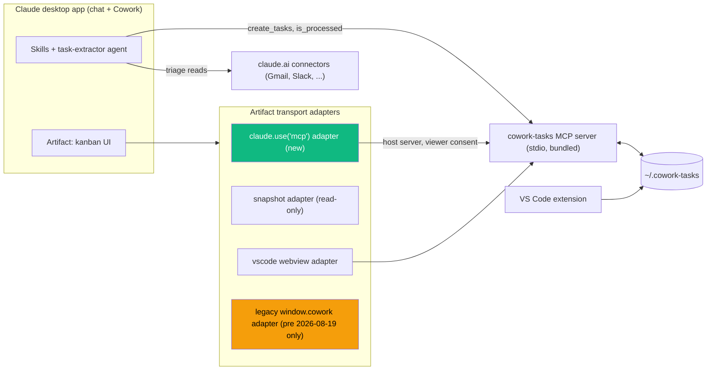
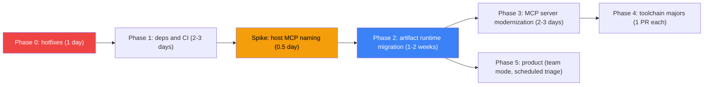

# Project audit and refactor plan (October 2026)

Audit date: 2026-10-05. Scope: whole repo at commit `46cd3b3` (v0.4.14).
Method: read every manifest, skill, agent, doc and the artifact bridge code; ran the official `claude plugin validate`, `pnpm install/typecheck/lint/test/build`, `pnpm audit --prod`; compared against Anthropic's current docs (sources at the bottom).

---

## 1. Verdict

The plugin packaging is in good shape and the baseline is healthy. The problem is the **platform underneath the artifact**, which Anthropic replaced in August 2026. The project's headline feature (the board as a "Live Artifact") is built on an API surface that is now legacy and, per Anthropic's own bug tracker, partly broken.

| Area | State |
|---|---|
| Plugin layout, `${CLAUDE_PLUGIN_ROOT}` usage, no `bin/`, bundled MCP server | Correct and current |
| `claude plugin validate` (plugin and marketplace) | Passes, 1 warning (`logo`) |
| Typecheck, lint, 40 unit tests, build | All green; committed `bundle/` and `artifact/` match a fresh rebuild (no drift) |
| Live artifact integration (`open-board`, `api.ts`, `mcp_tools`) | **Built on the legacy model; at risk** |
| Wording across README, docs, skills, landing | Many stale Cowork UI terms |
| Dependencies and CI | 1 to 2 years behind; 43 prod advisories (41 via one SDK pin) |

Top five things to act on:

1. **The artifact runtime changed on 2026-08-19.** "Live artifacts" are now a legacy format. New Cowork artifacts are regular artifacts with a new capability runtime (`claude.use("mcp")`, `claude.use("sample")`, ...). `window.cowork.*` and `cowork.create_artifact({mcp_tools})` are not the forward path. (Section 3.1)
2. **A concrete bug today:** the artifact calls `restore_task` (Undo-delete toast, added in 0.4.14) but the `mcp_tools` allowlist in `open-board` omits it, so Undo fails silently. (Section 3.2)
3. **A real injection surface:** `Markdown.tsx:144` passes `urlTransform={(u) => u}`, which turns off react-markdown's `javascript:` / `data:` URL filtering, on text that originates from email and Slack. (Section 3.5)
4. **Release plumbing is inconsistent:** release-please thinks everything is `0.1.0` while packages are `0.4.14`, and the plugin's `version` field **pins** installs (users get no update unless it is bumped). (Section 3.7)
5. **Docs describe a UI that no longer exists** ("Cowork tab", "Personal plugins -> Upload local plugin", `.plugin` rejected, `Live Artifacts tab`). (Section 2)

---

## 2. Terminology map: what changed officially

| In this repo | Current official term or behavior | Where it appears in the repo | Source |
|---|---|---|---|
| "Live Artifacts", "live artifact", "Live Artifacts tab" | Legacy label for Cowork artifacts made **before 2026-08-19**. They keep working but cannot be edited in place. Newer ones "work like any other artifact", live in the **Artifacts** view, are versioned, shareable, and open on desktop and web. | `README.md:35,66,133,176`, `docs/architecture.md:8`, `docs/local-install.md:44,62`, `packages/landing/public/index.html:474,540`, `scripts/social-preview.html:305`, `packages/artifact/package.json:4`, `packages/mcp-server/package.json:4`, `packages/plugin/skills/open-board/SKILL.md:3` | [Live artifacts](https://support.claude.com/en/articles/14729249-use-live-artifacts-in-claude-cowork), [Artifacts](https://support.claude.com/en/articles/17153992-what-are-artifacts-and-how-do-i-use-them) |
| `cowork.create_artifact`, `update_artifact`, `list_artifacts`, `mcp_tools` allowlist | Artifacts declare `capabilities`. Connector access is `capabilities.mcp.servers: [{server, tools}]` with viewer consent. Open bug: create/update emit an empty allowlist since ~2026-07-28; `create_artifact` exposes only `{id, file_uuid, description}`. | `open-board/SKILL.md:45-125`, `scripts` `validate-skills.mjs` | [anthropics/claude-code#84277](https://github.com/anthropics/claude-code/issues/84277) (closed as dup of #80365), runtime contract 0.2.69 |
| `window.cowork.callMcpTool / askClaude / runScheduledTask`, `window.claude.callTool / complete / sendToChat` | `await window.claude.use("mcp")` (connector calls, `watchTool` for polling/caching), `use("sample")` (ask Claude), `use("db")`, `use("artifact")` (self-republish). `window.claude` carries only `use`. | `packages/artifact/src/api.ts:25-96,509-567`, `vscode-ext/src/extension.ts:156-203`, `test/e2e/harness.ts:332` | runtime contract 0.2.69 (`claude.d.ts`, `mcp.d.ts`, `sample.d.ts`) |
| "Switch to the Cowork tab" | Cowork and chat are merged into one conversation experience (staged rollout). "Cowork" is still used as a surface name in Anthropic's plugin docs ("Cowork tasks in the desktop app"), so **keep the product name, drop the tab instructions**. | `docs/local-install.md:28`, `SECURITY.md:52` ("Cowork tab") | [Cowork and chat are one Claude](https://support.claude.com/en/articles/16761823), [platform support](https://claude.com/docs/plugins/platform-support) |
| "Open Customize -> Connectors in the Cowork sidebar" | **Customize** is the page holding connectors, skills and plugins (`claude.ai/customize/...`). | `setup/SKILL.md:16,42`, `README.md:31,102,109`, `docs/*.md`, `SECURITY.md:49` | [Plugins overview](https://claude.com/docs/plugins/overview) |
| "Cowork-native / Cowork-hosted MCP connectors" (house term) | Plain **connectors** (claude.ai / Anthropic-hosted). In a plugin, bundled connectors show on the plugin's **Connectors** tab as Connected / Not connected / Not added. Installing a plugin does **not** add or sign in to any connector. | everywhere; `CONNECTORS.md` says they "appear in your Connectors panel ready to enable" | [Bundled connectors](https://claude.com/docs/plugins/overview#bundled-connectors) |
| "Personal plugins -> + -> Upload local plugin" | **Customize > Plugins > Add > Upload plugin**; marketplaces via **Add > Add marketplace**; browse via **Discover**. | `docs/local-install.md:30`, `scripts/pack-local.mjs` (final log line), `README.md:56` | [Install plugins in Cowork](https://claude.com/docs/cowork/guide/plugins) |
| "Upload dialog rejects `.plugin`, must be `.zip`" (issue #28337) | Docs now say upload a `.zip` **or** `.plugin`. Zip may hold the folder or its contents. | `docs/local-install.md:22,36`, `pack-local.mjs` header | [Plugin structure and testing](https://claude.com/docs/plugins/build) |
| "There is no in-place reload" | Claude Code: `claude --plugin-dir <path>` for a session, `/reload-plugins` for synced ones. Cowork warns before an update overwrites local edits. | `docs/local-install.md:60` | [Plugins reference](https://code.claude.com/docs/en/plugins-reference) |
| `/plugin update cowork-tasks` | Claude Code: `claude plugin update cowork-tasks` (restart to apply). Cowork/claude.ai: **Check for updates** on the marketplace, or **Sync automatically**. | `open-board/SKILL.md:136` | `claude plugin update --help` |
| `plugin.json` `"logo"` | Not a field (validator warns, Claude Code strips it). `icon` is read only by Anthropic's directory. `displayName` now exists. | `plugin.json` | [Manifest reference](https://code.claude.com/docs/en/plugins-reference) |
| Skill `name: Set up sources`, `Open board`, ... | Skill `name` is a lowercase-hyphen identifier that should match the folder (`setup`, `open-board`). The validator does not catch spaces, so it passes silently. | all 6 `SKILL.md` | [Skills](https://code.claude.com/docs/en/skills), [Plugin structure](https://claude.com/docs/plugins/build) |
| MCP spec "2025-11-25" | Latest is **2026-07-28** (stateless core, header routing, cacheable lists). | `CHANGELOG` 0.4.10, `server.ts` | [MCP changelog](https://modelcontextprotocol.io/specification/2026-07-28/changelog) |

Not renamed, nothing to do: skills now cover former slash commands (the repo already uses `skills/`), `${CLAUDE_PLUGIN_ROOT}`, `.mcp.json`, agent `model: sonnet`, `type: "http"` servers.

---

## 3. Findings

Severity: **P0** broken or unsafe now, **P1** outdated or inaccurate, **P2** hygiene.

### 3.1 Artifact platform migration (P0, strategic)

**Evidence.** `open-board/SKILL.md` drives `cowork.list_artifacts` / `create_artifact` / `update_artifact` with an `mcp_tools` list in `mcp__<server>__<tool>` form. `api.ts` calls `window.cowork.callMcpTool` and falls back to `window.claude.callTool`. `TESTING.md` already records that `window.claude.callTool` "doesn't actually exist in Cowork". The 0.4.13 changelog records host AI calls (`askClaude`, `complete`, `sendToChat`) unmounting the iframe, so AI buttons are now a clipboard fallback behind `SUPPRESS_AI_BRIDGE = true` (`api.ts:579`).

**What Anthropic did.** On 2026-08-19 live artifacts became legacy. Bug [#84277](https://github.com/anthropics/claude-code/issues/84277) reports `create_artifact` and `update_artifact` writing an empty `mcp_tools` for every artifact since ~2026-07-28, with no user-facing way to grant tool access, and a UUID-vs-name ID mismatch. The replacement is the capability runtime: a page declares what it needs and the viewer consents.

**Impact.** On a current build, `/open-board` probably yields a board that renders from `__INITIAL_STATE__` only (the "snapshot" path) and cannot read or write tasks. I could not confirm this on a live desktop build from here; treat as high-probability, verify first (Section 5, spike 1).

**Recommendation.** Introduce a transport seam, then add a new adapter. Keep the local-first MCP server as the source of truth.

Concrete steps:

1. Extract a `BoardTransport` interface from `api.ts` (list, get, create, update, move, archive, restore, config, ai). Today `callMcp` and the bridge detection are interleaved with UI-facing helpers.
2. Add `claudeUseMcp` adapter: `const mcp = await window.claude.use("mcp")`; use `watchTool` for the list poll (it handles caching and `refetchInterval`, replacing the hand-rolled 2 s loop) and `callTool` for mutations. Declare `capabilities: {mcp: {servers: [{server: "host:<name>", tools: [...]}]}, sample: {}}`.
3. Replace `SUPPRESS_AI_BRIDGE` with `use("sample")` (`sample(input, {modelTier: "quick"})`). This restores the four AI card actions natively and removes the clipboard fallback. Call only from a click, as the contract requires.
4. Rewrite `open-board` to publish through the Artifact tool with those capabilities instead of `cowork.create_artifact`. Delete the `clear_artifact_folder` workaround and its tool.
5. Keep `legacy-cowork` adapter behind detection so pre-August boards keep working until users republish.
6. Make the VS Code webview shim implement `claude.use` (it currently polyfills `callTool/complete/sendToChat`, `extension.ts:156-203`).

Alternative considered: move state into the artifact `db` capability (shared, live `onSnapshot`, works on web, gives team mode via `user`/`room`). It trades away local-first files, VS Code parity and git-friendly tasks, and caps storage at 20 MB of text. Worth revisiting for the v1.0 "team mode" roadmap item, not for this migration.

### 3.2 Allowlist missing `restore_task` (P0, bug)

Server exposes 18 tools; the skill's allowlist has 13. The artifact calls `restore_task` (Undo toast on delete, 0.4.14) which is **not** in either allowlist block of `open-board/SKILL.md`. Also absent: `rename_label`. Result: Undo-delete fails silently under the allowlist model, and `validate-skills.mjs` only checks the entry *format*, not completeness.

Fix now: add `mcp__cowork-tasks__restore_task` and `mcp__cowork-tasks__rename_label`. Better: generate the allowlist from `TOOLS` in `server.ts` at build time and have `validate-skills.mjs` assert `artifactCalls subset-of allowlist subset-of serverTools`. This also carries over to the new `capabilities.mcp.servers[].tools` list, which must name every tool the page calls (an empty or partial list is refused or breaks calls).

### 3.3 Plugin manifest and packaging (P1)

| Item | Detail | Fix |
|---|---|---|
| `logo` | Unknown field, validator warning | Remove |
| `icon: "icon.png"` | Directory docs expect a `./`-relative path | `"./icon.png"` |
| Duplicate icons | `packages/plugin/icon.png` and `.claude-plugin/icon.png` are byte-identical | Keep one |
| No `displayName` | UI falls back to `cowork-tasks` | Add `"displayName": "Cowork Tasks"` |
| `keywords` only in marketplace entry | `plugin.json` has none | Add to `plugin.json`, drop from entry |
| `version` in 3 places | `plugin.json`, marketplace entry, `metadata.version`. `plugin.json` wins; mismatch only warns. **Setting `version` pins users** until it changes | Single source in `plugin.json`; remove from entry; wire into release-please `extra-files` |
| `hooks/hooks.json` = `{"hooks": {}}`, `settings.json` = `{}` | Empty files; `pack-local.mjs` has a special case stripping the hooks file | Delete both and the workaround |
| No `README.md` / `LICENSE` in `packages/plugin` | Anthropic's directory requires both; `pack-local` copies LICENSE only into the zip, so a git-source marketplace install lacks it | Add both |
| Skill names with spaces | See terminology map | `name: setup`, `open-board`, `triage-now`, `coach`, `health`, `new-task`; add `argument-hint` to `new-task` |
| Agent `task-extractor` | Pure JSON transform but inherits every tool | Add `tools:` allowlist (or `disallowedTools`), `effort`, `maxTurns`. Note: agents load in Cowork and Claude Code only, **chat ignores them** |
| Connector names inconsistent | `triage-now` lists `otter`, `read`; agent lists Discord, Telegram, Otter, Read, Zoom AI; none are in `.mcp.json` (26 declared); `setup` says Telegram/Discord are unsupported | Align to the 26 declared, or adopt Anthropic's `~~category` placeholder convention as used by the official `productivity` plugin so skills stay tool-agnostic |
| Local stdio server scope | Per platform support, a local MCP server **loads only in Cowork sessions running on the computer and Claude Code; chat ignores it** | State this in README requirements; keep desktop-only claim |

Verified fine, do not change blindly: empty `"url": ""` for `gmail` and `google calendar`, and the server name `"google calendar"` with a space, are identical to Anthropic's own `productivity` plugin (checked in the local plugin cache) and pass the official validator. Same for the Slack `oauth.clientId`. I could not verify the `ms365` URL against Anthropic's directory.

### 3.4 MCP server (P1)

- **SDK pin:** `^1.0.4` in `package.json`, locked at `1.29.0` (`pnpm-lock.yaml:497`); latest is `1.32.1`. Bump the range to `^1.32`.
- **Low-level API:** `server.ts` uses `Server` + `setRequestHandler` with hand-written JSON Schema **and** separate Zod schemas for the same tools (`server.ts:34-76` vs the `TOOLS` array). Migrate to `McpServer.registerTool` with Zod as the single source, add `title` and `outputSchema` / structured content. Keep the existing `annotations` (they are already good).
- **Spec:** header comment and 0.4.10 changelog target 2025-11-25; current is 2026-07-28. For a stdio server the stateless changes are mostly transparent via the SDK, but re-test.
- **Workaround tools to delete after 3.1:** `prepare_board_artifact`, `clear_artifact_folder` (a recursive `fs.rm` exposed to the model, `server.ts:698`), and `check_version` (does a network `fetch` of `raw.githubusercontent.com/.../plugin.json` at `server.ts:770`; its "run `/plugin update`" hint is wrong for Cowork).
- **Advisories:** `pnpm audit --prod` reports 43 (3 low, 29 moderate, 11 high). 41 come through `@modelcontextprotocol/sdk@1.29.0` (`hono`, `@hono/node-server`, `qs`, `ip-address`, `body-parser`, `fast-uri`). `hono` is not in the stdio bundle (0 hits), but `fast-uri` (via `ajv`) **is** (6 hits, 9 advisories). The remaining 2 are `braces` via `chokidar@3` in the bundled watcher. Bump the SDK and `chokidar` to 5.

### 3.5 Artifact UI security (P0)

`packages/artifact/src/components/Markdown.tsx`:

- `:144` `urlTransform={(u) => u}` disables react-markdown's default scheme allowlist. Card descriptions and comments are populated from email, Slack and meeting content, i.e. attacker-influenced text. A `[x](javascript:...)` link or `data:` URL is now clickable. Remove the override (default is safe) or allow only `http`, `https`, `mailto`.
- `` and `<video>` auto-load any remote URL, so opening a card derived from a hostile email fires tracking requests. Prefer `https` only plus click-to-load for remote media.
- `:36` loads `mermaid@11` from jsDelivr at runtime with a floating major and no SRI. Pin an exact version with `integrity`, or bundle it lazily. Under the new `mcp` capability the page holds the viewer's connector access, so any script injection is far more valuable than before.

Positive: raw HTML is **not** rendered (no `rehype-raw` in the pipeline), and mermaid uses `securityLevel: 'strict'`.

VS Code extension: the webview has `enableScripts: true` (`extension.ts:80`) and **no Content-Security-Policy** (0 hits). Add a nonce-based CSP per VS Code webview guidance.

### 3.6 Dependencies and toolchain (P1/P2)

| Package | Pinned | Latest | Note |
|---|---|---|---|
| Node (engines / CI) | `>=20`, matrix 20 and 22 | 22, 24 current | Node 20 reached end of life 2026-04-30. README still says "Node 18+" |
| `@modelcontextprotocol/sdk` | `^1.0.4` (locked 1.29.0) | 1.32.1 | Clears 41 advisories |
| `zod` | `^3.22` | 4.6 | SDK supports 4; do with 3.4 |
| `chokidar` | `^3.6` | 5.0 | Removes `braces` |
| `eslint` | `^8.57` | 10.x | v8 is EOL; `.eslintrc.cjs` -> flat config |
| `@typescript-eslint/*` | `^7` | 8.x | with eslint bump |
| `typescript` | `^5.4` | 7.x available | Move to latest 5.x first |
| `vite` / `@vitejs/plugin-react` | `^5.4` / `^4.3` | 8.x / 6.x | |
| `vitest` | `^1.4` | 5.x | |
| `react`, `react-dom` | `^18.3` | 19.x | check `@dnd-kit` compatibility |
| `tailwindcss` | `^3.4` | 4.x | config model changed |
| `@dnd-kit/sortable`, `@dnd-kit/utilities` | declared | **never imported** (only `@dnd-kit/core` is) | Remove |
| `rehype-raw` | declared | **never imported** | Remove |
| `@playwright/test`, `esbuild`, `lucide-react`, `prettier`, `@types/node` | 1.45 / 0.21 / 0.378 / 3.2 / 20 | 1.63 / 0.28 / 1.52 / 3.9 / 26 | Match `@types/node` to the engine |
| pnpm | 9.12 | newer majors exist | `packageManager` + CI `version: 9` |

GitHub Actions are all a major or more behind: `actions/checkout@v4` (v7.0.1), `actions/setup-node@v4` (v7.0.0), `pnpm/action-setup@v3` (v6.1.0), `googleapis/release-please-action@v4` (v5.0.0), `softprops/action-gh-release@v2` (v3.0.3). Pin by SHA while at it.

Upgrade order that keeps the build green: patch/minor sweep, then SDK + chokidar, then one PR per major (eslint, vite+vitest, react, tailwind, zod). `@playwright` e2e is the safety net for the UI majors. Note: I ran unit tests only; the 84-test Playwright suite claimed in the changelog was not run in this audit.

### 3.7 Release and CI (P1)

- `.release-please-manifest.json` and root `package.json` say `0.1.0`; `core`, `mcp-server`, `artifact` are `0.4.14`; `plugin/package.json` and `vscode-ext` are `0.1.0`; `landing` is `0.4.5`. `release-please-config.json` omits `packages/plugin` and does not update `plugin.json` / `marketplace.json`. Pick one version scheme (recommend: one version for the whole repo, release-please `extra-files` for the two JSON manifests).
- Two workflows react to releases: `release.yml` (release-please + `npm publish` with `NPM_TOKEN`) and `release-on-tag.yml` (zip + GitHub Release). `npm view` returns 404 for all three `@cowork-tasks/*` packages, so the README **npm badge is dead** and the publish step has apparently never produced a package. Decide: publish (use npm trusted publishing/OIDC, `id-token: write` is already set) or mark packages `private` and drop the badge.
- CI gaps: no `claude plugin validate`, no `pnpm audit`, no e2e, and no check that committed `packages/plugin/bundle/mcp-server.js` and `artifact/cowork-tasks.html` equal a fresh build. Those two files must stay committed (the marketplace installs `./packages/plugin` straight from git), so drift protection matters. Today they match; add `git diff --exit-code` after `pnpm build`.
- `packages/plugin` test script is `vitest run --passWithNoTests` with zero tests, and `vscode-ext` has `echo 'no tests yet'`. Add golden-set evals for `task-extractor` using the new `claude plugin eval`.
- `CONTRIBUTING.md` promises an "automated AI code review" on every PR; no workflow in `.github/` provides one. Confirm the GitHub App is installed or reword.

### 3.8 Docs and claims (P1/P2)

- **Product honesty:** README and landing say "always-on", "watches your communications", "refreshes every 2 seconds", yet `architecture.md` and `SECURITY.md` say triage runs on demand with "no background daemon". Reconcile. A real fix is a documented Cowork scheduled task running `/cowork-tasks:triage-now` (set up from the `setup` skill).
- `README.md:12,172` and `index.html:585`: "30x cheaper" and "$0.30/mo LLM" have no source in the repo; the competitor comparison table (Linear, Motion, Notion AI) makes absolute claims. Either link a methodology or soften.
- `README.md:52`: "Cowork Desktop (any version)" and "Node 18+". Use "Claude desktop app" and Node 22+.
- `README.md:56-58`: install steps should read **Customize > Plugins > Add > Add marketplace**, enter `sabbah13/cowork-tasks`, then install from **Discover**; "Sync" is a separate **Sync automatically** toggle. CLI line works but `plugin@marketplace` (`cowork-tasks@cowork-tasks`) is unambiguous.
- `docs/local-install.md`: see terminology map; replace the "uninstall then re-upload" loop with `claude --plugin-dir ./packages/plugin` for iteration.
- `packages/artifact/TESTING.md`: says 27 tests; changelog says 84 e2e; also contradicts `api.ts` on whether `window.claude.callTool` exists. Rewrite after 3.1.
- `ROADMAP.md` v1.0 "Team mode": new artifacts have `db`, `room`, `user` capabilities designed for shared boards; re-scope that item against them.

---

## 4. Refactor plan

| Phase | Work | Risk |
|---|---|---|
| 0 hotfixes | Add `restore_task`, `rename_label` to allowlist; remove `urlTransform` override and gate remote media; pin or remove mermaid CDN; manifest cleanup (3.3); mechanical wording pass from the terminology map | Low |
| 1 deps + CI | SDK to `^1.32`, `chokidar` 5, drop 3 unused deps, Node 22/24 matrix, Actions bumps, add `claude plugin validate`, `pnpm audit`, bundle-drift check; unify versions and release-please | Low |
| Spike | In the desktop app: publish a throwaway artifact declaring `host:<server>` for the bundled server and see which name resolves and what consent looks like (Section 5) | Gates Phase 2 |
| 2 migration | `BoardTransport` seam, `claude.use("mcp")` adapter with `watchTool`, `sample` for AI actions, rewrite `open-board`, retire workaround tools, update VS Code shim and e2e harness | Medium-high |
| 3 server | `McpServer.registerTool`, single Zod source, `outputSchema`, `title`, spec 2026-07-28 re-test | Medium |
| 4 toolchain | eslint flat config, vite 8 + vitest 5, react 19, tailwind 4, zod 4, one PR each, e2e green before merge | Medium |
| 5 product | Team-mode design on `db`/`room`/`user`; documented scheduled triage; extractor evals; `~~category` connector placeholders | Open-ended |

### Phase 0 status (v0.4.15)

Done in the hotfix PR: allowlist fix plus a validator that proves allowlist completeness (3.2); markdown URL filtering, https-only click-to-load media, pinned and SRI-checked mermaid, with unit and e2e tests that fail on the old code (3.5); `task-extractor` limited to `Read`; manifest and packaging cleanup, plugin README and LICENSE (3.3); terminology pass across README, docs, skills, landing page and package metadata (section 2); `docs/local-install.md` rewritten. `claude plugin validate` now passes with no warnings.

New finding while doing it: after the keyboard-navigation PR (#39) merged, the committed `packages/plugin/artifact/cowork-tasks.html` was stale relative to source. The audit's "no drift" result held for the commit it was run on only. The Phase 1 CI drift check (`git diff --exit-code` after `pnpm build`) would have caught it.

Verified in a real runtime (Claude Code 2.1.289, working copy loaded with `claude --plugin-dir`, isolated temp task store): the plugin loads as 0.4.15; all six skills register as `cowork-tasks:coach`, `health`, `new-task`, `open-board`, `setup`, `triage-now`; the `task-extractor` agent registers and, restricted to `Read`, returns correct JSON (creates only the owner's own items, skips FYI and other people's items, ignores a prompt-injection email, no canary-file leak); the bundled server connects with all 18 tools; `new-task`, `health`, and a `delete_task` then `restore_task` round trip all work; in a real browser the hardened markdown renders hostile links as plain text and loads remote media only on click. Not verified: the Claude desktop app itself (upload dialog, Connectors tab, icon rendering, `open-board` publishing in Cowork), because computer use cannot be granted control of the Claude app.

This also settles half of open question 1 in section 5: Claude Code names the bundled server `plugin:cowork-tasks:cowork-tasks` and its tools `mcp__plugin_cowork-tasks_cowork-tasks__<tool>`. Whether an artifact's `mcp` capability accepts that as a `host:` server is still untested.

Deliberately not in Phase 0: the VS Code webview CSP (3.5), reconciling "always-on" positioning and unsourced cost claims (3.8), the dead npm badge and publish decision (3.7), re-rendering `social-preview.png` and `og.png` (they still say "Live Artifacts ready"), and the Node 22/24 CI matrix move. That last one needs the branch protection's required checks (`build (20)`, `build (22)`) renamed in the same step, or `main` becomes unmergeable.

---

## 5. What I could not verify (check before relying on this)

1. **Host-server naming for a plugin-bundled MCP server.** The contract says `host:<name>` is the segment between `mcp__` and the next `__` in the server's tool names, and only servers from the user's MCP configuration count. Anthropic documents plugin tools as `mcp__plugin_<plugin>_<server>__<tool>`, so the name is probably `host:plugin_cowork-tasks_cowork-tasks`, but whether a *plugin* server qualifies is unconfirmed. This decides whether Section 3.1 option A works as written.
2. **Current Cowork build behavior** of `/open-board` (whether `create_artifact` still accepts what the skill sends). Unification is a staged rollout, so accounts differ.
3. The 84-test Playwright suite (not run).
4. The `ms365` connector URL, README cost and competitor claims, and whether an AI review app is installed on the repo.

---

## Sources

- Plugin manifest reference: https://code.claude.com/docs/en/plugins-reference
- Marketplace reference: https://code.claude.com/docs/en/plugins/marketplace-reference
- Skills: https://code.claude.com/docs/en/skills
- Subagents: https://code.claude.com/docs/en/sub-agents
- MCP in Claude Code (plugin-provided servers, tool naming): https://code.claude.com/docs/en/mcp
- Plugins in Claude and Cowork: https://claude.com/docs/plugins/overview
- Plugin feature support by app: https://claude.com/docs/plugins/platform-support
- Plugin structure and testing: https://claude.com/docs/plugins/build
- Install plugins in Cowork: https://claude.com/docs/cowork/guide/plugins
- Live artifacts in Cowork: https://support.claude.com/en/articles/14729249-use-live-artifacts-in-claude-cowork
- Artifacts: https://support.claude.com/en/articles/17153992-what-are-artifacts-and-how-do-i-use-them
- Cowork and chat are one Claude: https://support.claude.com/en/articles/16761823
- Empty `mcp_tools` bug: https://github.com/anthropics/claude-code/issues/84277
- MCP spec 2026-07-28: https://modelcontextprotocol.io/specification/2026-07-28/changelog
- Artifact capability runtime contract 0.2.69: read from the `artifact-capabilities` skill bundled with Claude Code 2.1.288 (type definitions `claude.d.ts`, `mcp.d.ts`, `sample.d.ts`); not in the public docs I could reach.
